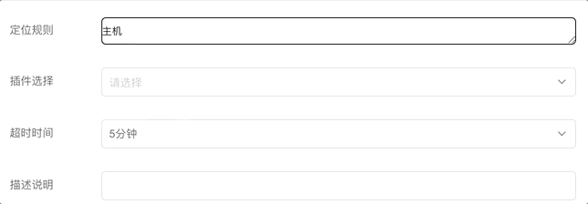

# wecube-portal-components

## 引言

高效的开发，离不开基础工程的搭建。此仓库是WeCube Portal前端开发所需的前端业务组件仓库，开发者可以使用这些业务插件来快速开发插件应用。

- 说明：组件开发及封装基于 [Vue](https://vuejs.org/) + [iView](https://www.iviewui.com/)

## 引入iView

一般在 webpack 入口页面 main.js 中如下配置：

```js
import Vue from 'vue';
import VueRouter from 'vue-router';
import App from 'components/app.vue';
import Routers from './router.js';
import iView from 'iview';
import 'iview/dist/styles/iview.css';

Vue.use(VueRouter);
Vue.use(iView);

// The routing configuration
const RouterConfig = {
    routes: Routers
};
const router = new VueRouter(RouterConfig);

new Vue({
    el: '#app',
    router: router,
    render: h => h(App)
});
```

## 组件

### 表格

概述：主要用于展示大量结构化数据，支持过滤，排序，分页，导出和自定义操作。


1， 基本表格 [传送门](components/table/simple-table.vue)  
有分页和数据展示功能。

API：  
Table props：  

| 属性              | 说明         | 类型      | 默认值                                                                          |
|-----------------|------------|---------|------------------------------------------------------------------------------|
| data            | 显示的结构化数据   | Array   | \[\]                                                                         |
| columns         | 表格列的配置描述   | Array   | \[\]                                                                         |
| page            | 分页所需属性配置   | Object  | \{        currentPage: 1,         pageSize: 5,           total: 0         \} |
| pageSizeOptions | 页面size可选配置 | Array   | \[5, 10, 20\]                                                                |
| loading         | 表格是否加载中    | Boolean | false                                                                        |

Table events：  

| 事件名              | 说明                                          | 返回值        |
|------------------|---------------------------------------------|------------|
| onChange         | 切换每页条数时的回调，返回切换后的每页条数；调用父组件pageChange方法     | 页码         |
| onPageSizeChange | 切换每页条数时的回调，返回切换后的每页条数；调用父组件pageSizeChange方法 | page\-size |
| onRowClick       | 单击某一行时触发                                    | 当前行的数据     |

2， 复杂表格 [传送门](components/table/table.js)  
有过滤，排序，分页，导出和自定义操作功能，以及行内编辑（支持文本，日期，下拉，引用等组件）。  
API：  
Table props：  

| 属性                | 说明             | 类型      | 默认值   |
|-------------------|----------------|---------|-------|
| tableColumns      | 表格列的配置描述       | Array   | \[\]  |
| tableData         | 显示的结构化数据       | Array   | \[\]  |
| showCheckbox      | 是否显示复选框        | Boolean | true  |
| highlightRow      | 是否支持高亮选中的行，即单选 | Boolean | false |
| filtersHidden     | 是否隐藏搜索条件       | Boolean | false |
| tableOuterActions | 表格外部功能区配置      | Array   | \[\]  |
| tableInnerActions | 表格内部功能区配置      | Array   | \[\]  |
| pagination        | 分页信息配置         | Object  | \{\}  |
| ascOptions        | 排序配置           | Object  | \{\}  |

### 链  

概述：链主要用于定位规则以及变量替换。通过在文本框内输入英文状态下的标点```.```(点)和```-```（横杠)来选取CI Type的属性及引用。



1，基本链  [传送门](components/chain-input/chain-input.vue)  
API:  
chain input props:

```JSON
    value: {
      required: false
    },
    rootCiType: {
      default: ""
    },
    allCiTypes: {
      type: Array
    },
    cmdbColumnSource: {
      default: ""
    },
    canReSelectCiType: {
      default: false,
      required: false
    },
    isReadOnly: {
      default: false,
      required: false
    },
    ciTypesObj: {
      default: null,
      required: false
    },
    ciTypeAttributeObj: {
      default: null,
      required: false
    },
    sourceData: {
      type: String,
      required: false
    },
    isEndWithCIType: {
      type: Boolean,
      default: false,
      required: false
    }
```

2，带有枚举选择的链 [传送门](components/chain-input/chain-input-with-enum.vue)  

API:  
chain input props:

```JSON
    allCiTypes: { required: true },
    allCodes: { required: true },
    rootCiType: { required: true },
    ciTypesObj: { required: true },
    ciTypeAttributeObj: { required: true },
    paramData: { required: true },
    value: {}
```
